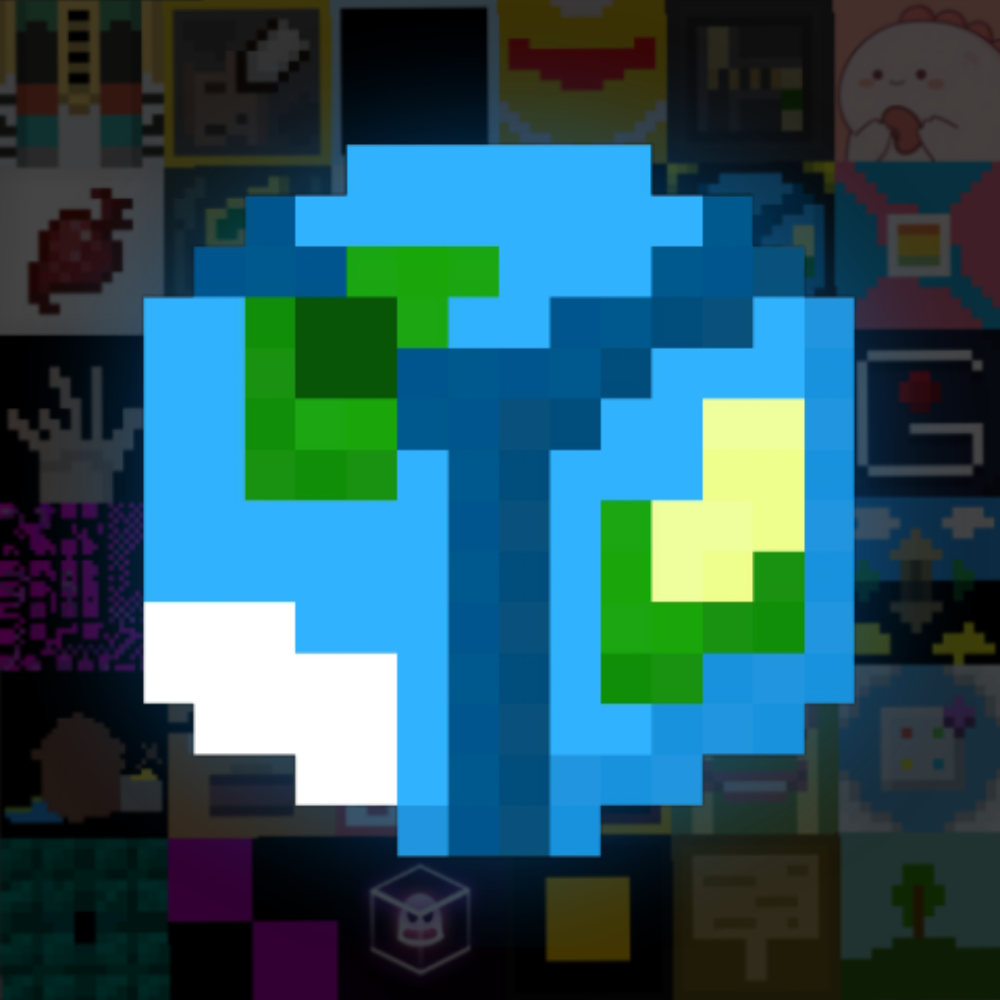
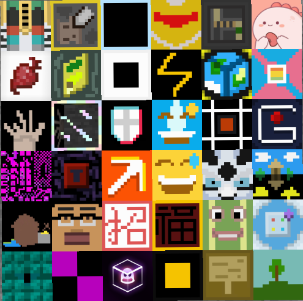
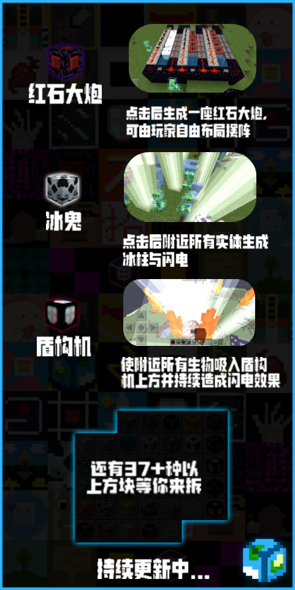

 **注意，该模组代码仅可用来预览，你无法装载在Minecraft国际版中。如果你想游玩该模组，请前往我的世界中国版基岩端中搜索开发者账号“刷怪笼工作室”，选择对应的模组购买并下载使用。如果你也是Minecraft爱好者，不妨点个Star支持下，谢谢！** 

**Note that this module code is only available for preview and cannot be loaded into Minecraft International Edition. If you want to play this module, please search for the developer account "Brushing Monster Cage Studio" in my World China version of the bedrock platform, select the corresponding module to purchase and download for use. If you are also an MC enthusiast, why not click on Star support? Thank you!**

在本模组中，作者在各大媒体平台包括但不限于Bilibili，抖音，快手，小红书和西瓜视频等平台发布了持续三个月的像素盲盒方块计划，在整个过程中收集并筛选出了由玩家所制作的30多张像素方块贴图和点子，并且作者将这些贴图和点子结合起来做出了许多有意思的方块。更多关于这个计划的内容请解压BlindBox-material.zip里的PPT观看吧！里面包含整个策划的内容和参与方式。

在本模组中，包含接近40种盲盒方块，例如无限改变大小，超级炸药，经典沙子电路，红石大炮，炫酷的闪电方块以及能改变日昼的时间方块或是各种材料包工具包等。

以及其它像素道具（像素剑/元素石等...），例如像素盲盒镜等，部分像素道具不会在创造背包中出现，请注意。

部分盲盒方块可在工作台合成，大部分方块则需要通过"盲盒方块"进行抽取，"盲盒方块"需要在工作台进行合成。

需要特别注意的是，部分有毁图风险的方块已在名字上打上了危险标记，请放心食用。

